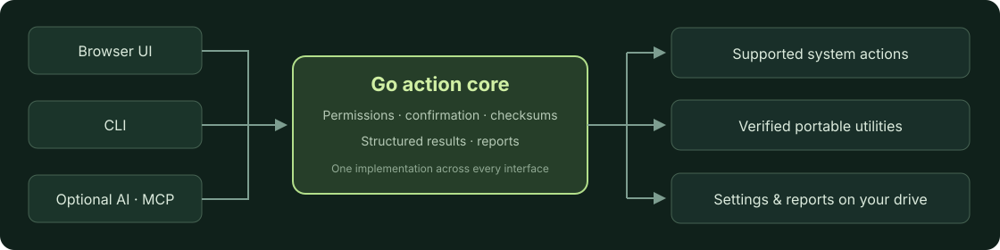
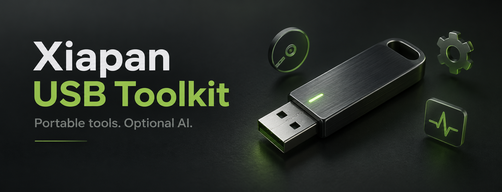

<p align="center">
  
</p>

<p align="center"><a href="README.md">English</a> · <a href="README.zh-CN.md">简体中文</a> · <a href="README.ja.md">日本語</a></p>

# Xiapan USB Toolkit

**持ち歩ける PC メンテナンスツール。AI は必要なときだけ。**


[クイックスタート](#クイックスタート) · [対応プラットフォーム](#対応プラットフォーム) · [USB パッケージの作成](#windows-用-usb-パッケージの作成) · [貢献ガイド](CONTRIBUTING.md)

> [!NOTE]
> **現在はプレビュー版です。** Windows x64 は実際の USB ドライブで検証済みです。macOS / Linux の完全なパッケージは開発中です。このリポジトリにはソースコードが含まれますが、すべてのツールやモデルの重みは含まれません。

## メンテナンスツールを持ち歩く

PC の状態を確認し、必要なツールを探し、設定とレポートを自分のドライブに保存できます。AI を使わずに操作することも、診断結果の理解に AI を利用することもできます。

| 機能 | 内容 |
|------|------|
| PC の状態を確認 | システム情報、プロセスのメモリ使用量、一般的なスタートアップ項目とネットワーク機器を確認。 |
| ツールを探す | カテゴリ検索と利用可能状態の表示、公式ダウンロードへのリンク。 |
| ドライブに保存 | 設定、会話、メンテナンスレポートを持ち運べます。 |
| AI を選択 | 自分の互換 API、Xiapan Cloud、または別途準備するローカルモデルを利用。 |

## クイックスタート

**Git と Go 1.24 以降**を用意してください。各 OS で同じリポジトリを使用します。

```sh
git clone https://github.com/dongsheng123132/xiapan-usb.git
cd xiapan-usb
go test ./...
go build -o dist/xiapan .
./dist/xiapan action run system.inspect --json --no-input
```

Windows では `go build -o dist/xiapan.exe .` と `./dist/xiapan.exe` を使用します。この手順でビルドされるのはコアプログラムです。PicoClaw、ローカルモデル、外部ツールは自動では同梱されません。[開発ガイド（中国語）](docs/DEVELOPMENT.md)も参照してください。

## ツールカタログ

**全 35 項目**：対応済みポータブルツール 6 種、Windows 標準ツール 6 種、追加候補アプリ 19 種、復旧・ドライバー関連リソース 4 項目。名前・用途の検索、カテゴリと利用可能状態の絞り込みに対応します。

| 対応済みツール | 用途 |
| --- | --- |
| WinDirStat | ディスク使用量の可視化 |
| PeaZip | ファイルの圧縮と展開 |
| Everything | ファイル検索 |
| Explorer++ | ファイルの閲覧と管理 |
| Notepad++ | テキストと設定ファイルの編集 |
| SumatraPDF | PDF の閲覧 |

追加ツールパックは、公式配布元からのダウンロードとチェックサム検証を経て、この 6 種を同梱します。**カタログにあることと、インストール済みであることは異なります。** ライセンスや検証状況により、公式リンクのみの項目もあります。

## AI は任意です

| モード | 利用方法 |
| --- | --- |
| AI なし | 対応するローカル診断とツール起動にクラウドのウォレットは不要です。 |
| オンライン AI | 任意の PicoClaw エージェントから、自分の OpenAI 互換 API・モデル・キー、または Xiapan Cloud を使用します。 |
| オフライン AI | Windows CPU ランタイムと Qwen3.5-0.8B の別リソースパックを準備します。小型の標準パッケージには含まれません。 |

GUI、CLI、AI は同じ Go アクションコアを使用します。PicoClaw アダプターでは任意のシェル実行、ファイル編集、スキルのインストール、サブエージェントを無効化しています。AI が「確認済み」と指定しても、ユーザー確認を迂回できません。



## 対応プラットフォーム

| プラットフォーム | 検証範囲 |
| --- | --- |
| **Windows x64** | 2 本の実物 USB ドライブで基本動作、うち 1 本で 6 種のツールを検証。同じ Windows PC 上での結果であり、すべての PC での動作保証ではありません。 |
| macOS · Apple Silicon / Intel | コアのクロスビルドに対応。ネイティブのエージェント、モデルランタイム、ツールと実機検証は未完了です。 |
| Linux x64 | コアのビルドと WSL 上の診断・レポート処理を検証済み。デスクトップと実物 USB での全体検証は今後の作業です。 |

同じドライブに複数 OS 用のプログラムを保存できますが、各 OS 専用の実行ファイルが必要です。**現時点では起動可能なレスキュー OS ではありません。** スタートアップ検査は一般的な Run 項目とスタートアップフォルダーを対象とし、全サービスやタスクを網羅せず、自動無効化もしません。

## Windows 用 USB パッケージの作成

作成には Go、PowerShell、Python 3 が必要です。作成後のパッケージを使うユーザーには Go・Python・Node は不要です。

```powershell
.\scripts\prepare-picoclaw.ps1
.\scripts\build.ps1
python scripts/package-genie.py
```

<details>
<summary>外部ツールとローカルモデルを追加する</summary>

`python scripts/prepare-portable-tools.py` を実行し、再ビルドしてから `python scripts/package-genie.py --with-tools` を実行します。固定バージョンと SHA-256 で検証し、既存のツールディレクトリは上書きしません。

ローカルモデルの準備は `scripts/prepare-local-ai.ps1` を参照してください。標準の小型パッケージにはモデルの重み、ドライバー、復旧用イメージを含めません。

</details>

```text
虾盘.exe   起動プログラム
app/       エンジン・追加ツール・ライセンス・チェックサム
data/      設定・会話・レポート
```

> [!IMPORTANT]
> API キーとバックアップは現在、ドライブ内に**平文で保存**されます。ドライブを適切に管理してください。別の PC でも接続可能な API と有効なキーが必要です。localhost のモデルサーバーは利用先の PC で起動してください。更新時は `data/` と各ツールの個人設定を保持し、使用済みのデータを出荷用にコピーしないでください。

## オープンソースと設定済みドライブ

本プロジェクト独自のソースは [MIT ライセンス](LICENSE)です。無料で入手して自分で準備することも、提供される場合は設定済みドライブを購入することもできます。物理ドライブの価値は、ハードウェア、事前ダウンロード、設定・動作確認、サポートです。ローカルの基本機能にクラウドへの課金は必要ありません。

外部ソフトウェアとモデルには各ライセンスが適用されます。[第三者ライセンス](THIRD_PARTY.md)と[配布ガイド（中国語）](docs/DISTRIBUTION.md)を確認してください。

<details>
<summary>プロジェクトのコンセプトアート</summary>



出荷製品の写真ではなく、プロジェクト用のイラストです。[デザインと使用ツール](docs/README-DESIGN.md)。

</details>

## 開発に参加する

プラットフォーム対応、再現可能な不具合報告、ポータブルツールの追加を歓迎します。[貢献ガイド](CONTRIBUTING.md)、[セキュリティ](SECURITY.md)、[Issue](https://github.com/dongsheng123132/xiapan-usb/issues)をご利用ください。ウォレットの URL、API キー、個人の診断データは公開しないでください。README の翻訳は、アプリ UI の多言語対応を意味しません。

[Xiapan Cloud](https://cloud.u-claw.org/) · [U-King](https://www.u-king.org/) · [Xiapan Canvas](https://tu.u-claw.org.cn/)
